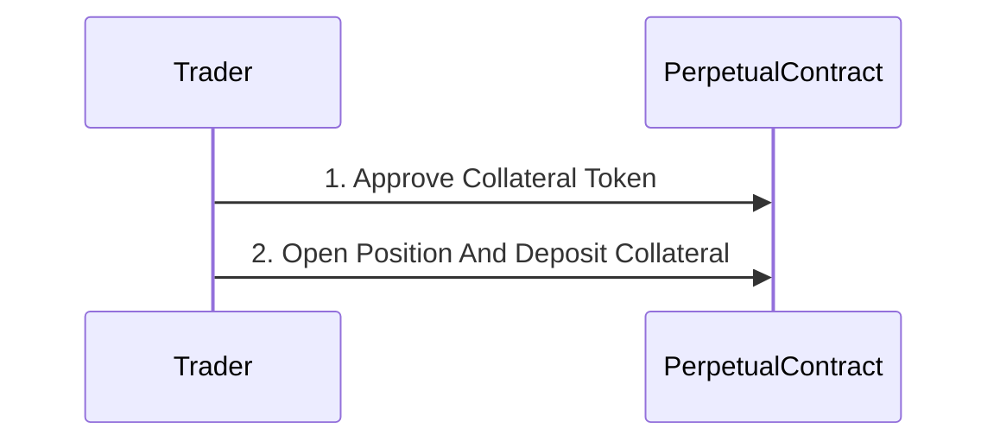
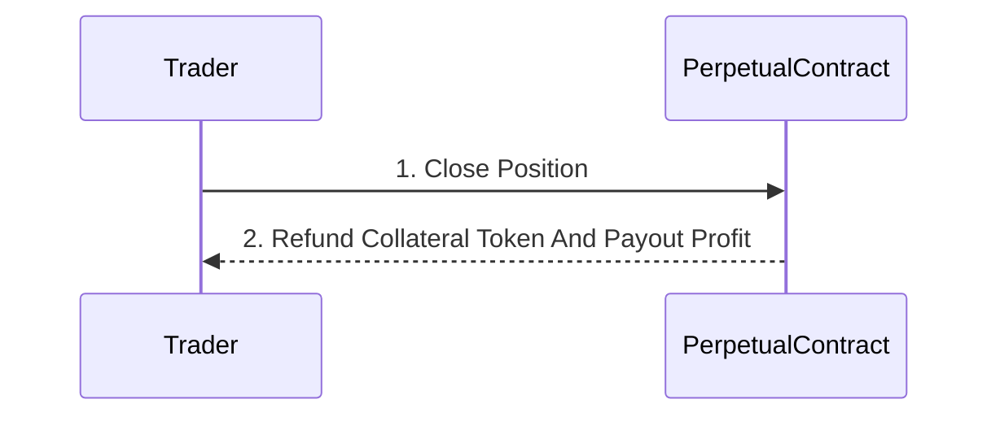
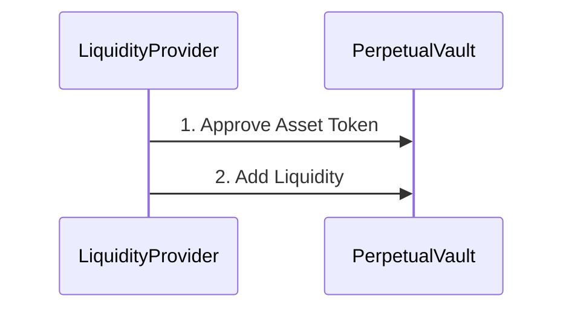
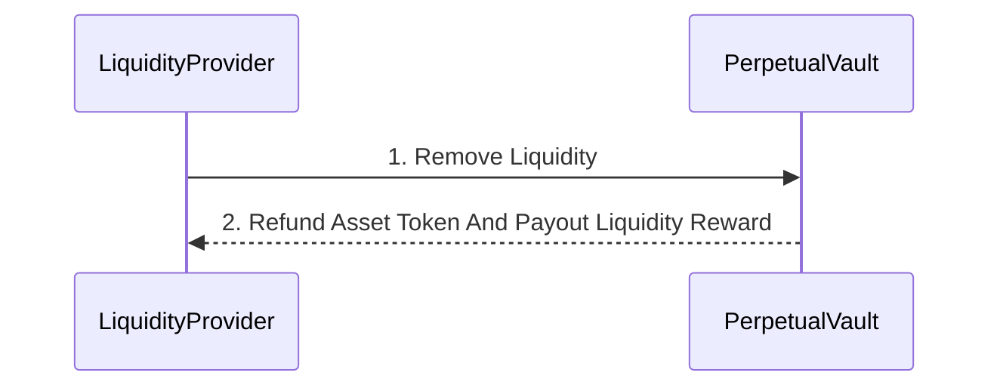
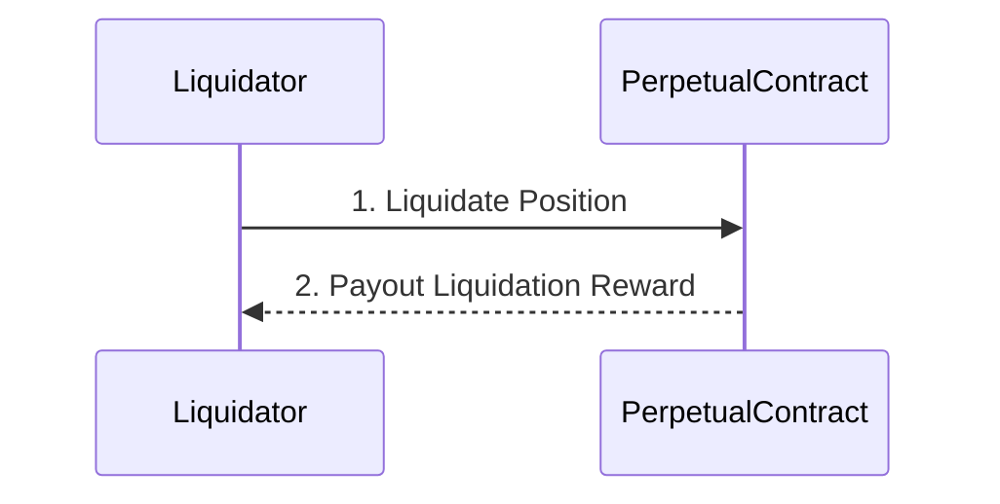

# Decentralized Perpetual Contract Protocol

## Project Overview
This project is a collection of smart contracts written in Solidity for the Ethereum blockchain.
The contracts are designed to interact with the Algebra protocol, a decentralized finance (DeFi) platform.
The contracts provide leveraged perpetual contract trading, and allow for earning liquidity rewards and liquidation rewards.

## Roles in the Contracts

The contracts define three main roles:

1. **Trader**: This role is responsible for executing trades on the platform.

2. **Liquidity Provider**: This role is responsible for providing liquidity to the platform. They can add or remove liquidity as needed.

3. **Liquidator**: This role is responsible for liquidating positions when necessary.

## Scenario

The contracts are designed to be used in the following scenario:

### Opening a Position

### Closing a Position

### Providing Liquidity

### Removing Liquidity

### Liquidating a Position

